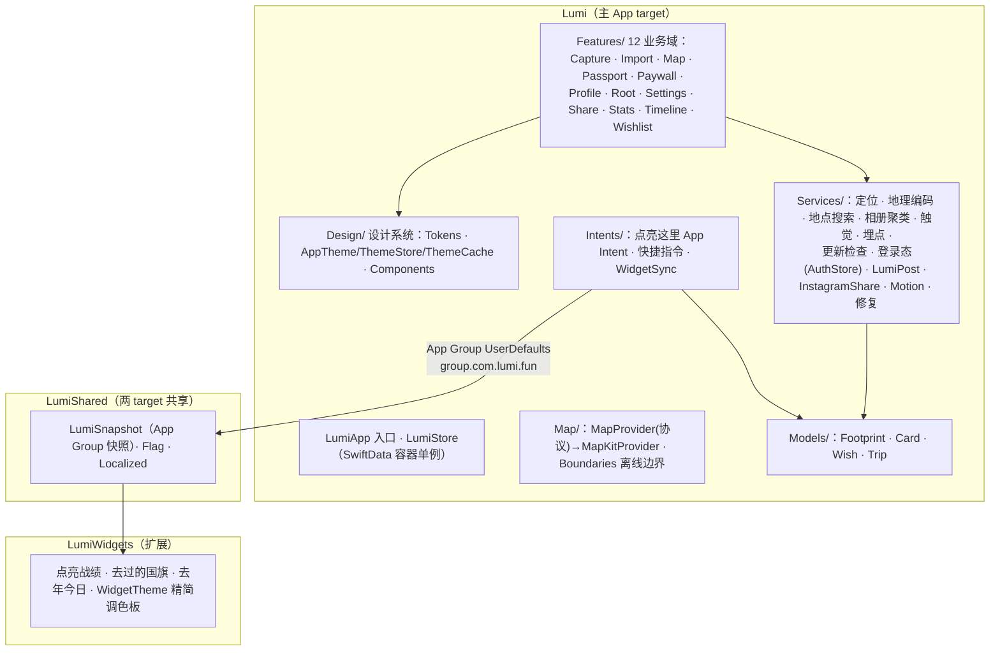

# Lumi 全 App 技术架构（现状 + 演进）

> 2026-07-07 重写，取代原「v0 架构说明」（v0 细节已并入）。上半部分描述**当前已实现**（截至 v1.1
> 邮局接线完成），下半部分是**各版本架构演进规划**。产品侧对应：[`PRODUCT-MAP.md`](../product/PRODUCT-MAP.md)
>（功能架构）、[`ROADMAP.md`](../product/ROADMAP.md)（节奏）。专项设计：[`DESIGN-store.md`](../design/DESIGN-store.md)
>（资源商店）、[`DESIGN-v1.1-lumi-post.md`](../design/DESIGN-v1.1-lumi-post.md)（邮局）、
> [`DESIGN-accounts-and-exchange.md`](../design/DESIGN-accounts-and-exchange.md)（账号）。

## 0. 技术栈与硬约束

| 维度 | 选择 | 原因 |
|------|------|------|
| 平台 | iOS 17+ · SwiftUI · SwiftData | 单人开发快迭代；MapPolygon 需 17 |
| 地图 | MapKit（经 `MapProvider` 抽象） | v0 零三方依赖；可换 Mapbox/高德 |
| 边界 | Natural Earth 离线打包 | 点亮判定不依赖网络 |
| 变现 | StoreKit 2 | 终身买断 `com.lumi.plus.lifetime` |
| 后端 | **纯本地优先**；v1.1 起 Supabase Free（仅 RPC） | 无账号先行，服务成本 $0 |
| 本地化 | 中/英/阿（含 RTL），xcstrings | 目标市场 |

开发流程约束：仓库在无 Mac 容器内开发，**不能本地编译**，改动由 ICY 真机验证。因此架构偏保守：
不引第三方 SDK、不动 pbxproj（FileSystemSynchronizedRootGroup，新文件自动入 target）、
所有服务端能力都要有「未配置即隐身」开关（§3.6 已验证此路径）。

## 1. 目标分层（现状）



- **单容器**：`LumiStore.shared` 是唯一 `ModelContainer`，主 UI 与「点亮这里」App Intent 同进程共用，避免双容器写冲突。
- **Features 域内自治**（视图 + 域私有模型同文件夹），跨域复用才下沉 Services/ 或 Design/。
- **小组件不读数据库**：主 App 聚合成 `LumiSnapshot` 写 App Group，小组件只读——单向数据流，扩展进程零 SwiftData。

## 2. 数据模型

### 2.1 SwiftData 持久化（4 实体）

- **Footprint（宇宙中心）**：一次点亮 = 一条。`id(unique)` · 坐标一律 WGS-84 · `countryCode?`/`subRegionCode?`
  （UAE 酋长国下钻）· `visitedAt/endedAt?` 行程起止 · `mood`/`companions` · `photoAssetIDs`（**引用相册不拷原图**，
  失效显示占位不崩溃）· 明信片外观 `postcardStyle` + `stampStyle`（存 StampKind.raw）· `entryMeans`（海陆空入境）
  · **接收面**：`isReceived`/`senderName`/`receivedAt`/`receivedCoverData(.externalStorage)`——
  **收到的明信片也是 Footprint**，免费获得时间轴/统计的全部能力。关系：`trip?`、`card?(cascade)`。
- **Card**：录入时 1:1 同建的明信片卡（模板 id + 缓存图名），为分享/印刷打底。
- **Wish**：心愿地点（与 Footprint 平级的轻实体）。
- **Trip**：行程容器，v0 最薄一层。

### 2.2 派生层（零存储）
`LumiStats`/`Badge`/`BadgeBoard`/大洲征服/图鉴解锁态，全部由 `[Footprint]` 现算（Achievements.swift、CodexView），
**单一计算入口**保证四个页面口径一致；徽章不落库避免 SwiftData 迁移与状态不同步。
→ 这是 v1.2 账号同步只需同步 **Footprint + Wish 两张表** 的关键前提。

### 2.3 点亮判定数据流（保留自 v0 文档）

```
点屏落点 / 录入确认地点 ──WGS-84──► Boundaries.countryCode(at:)   ← 离线 point-in-polygon（事实来源）
   ├─ 命中 "AE" → emirateCode(at:) 下钻酋长国
   ├─ 公海/无匹配 → countryCode = nil（散点 pin 不崩溃）
   ▼
CLGeocoder 补 placeName/cityName（best-effort，需网络）
   ▼
落库 Footprint + Card → @Query 自动刷新 → 地图着色 + 计数
```

计数口径：国家 = `distinct(countryCode)`，城市 = `distinct(cityName)`。
边界数据：`admin0.geojson`（110m，173 国）+ `uae_emirates.geojson`（10m，7 酋长国），坐标 4 位精度（≈11m），
射线法 + 包围盒剪枝；数据经脚本转 base64 内嵌（BoundaryData.swift）。

## 3. 关键机制（现状）

### 3.1 StampKind 统一邮票编码 ⭐ 商店化基石

四类邮票统一为 `StampKind`（RegionalStamp.swift），字符串 raw 存 `Footprint.stampStyle` 并随口令传输：

| case | raw | 目录来源（现状） | 解锁规则 |
|---|---|---|---|
| `.basic` | `air`/`land`/`sea` | 硬编码枚举 | 免费 |
| `.regional` | `cc:<ISO2>` | `static let all` 硬编码，SwiftUI 手绘 | 点亮该国即用，**限本国足迹** |
| `.festival` | `fest:<id>` | 硬编码 6 节日 | 窗口 ±5 天 + 地区匹配 |
| `.premium` | `prem:<id>` | `static let all` 硬编码 14 枚，imageset | Plus；限国家/子区域 |

**未知 raw → 回落 `.air`**——收到含未知邮票的明信片永远能渲染。商店化沿用此降级契约（§4.1）。

### 3.2 明信片交换（口令体系）
`PostcardToken.encode`（足迹要素 + 寄语 + 外观 raw + 发送日 + ≤100KB 压缩封面）→ `LUMI1:` 口令 →
四通道：链接 lumi:// / 二维码（无图版）/ AirDrop .lumicard / v1.1 站内直投。
`PostcardInbox` 四入口汇聚 → token **幂等去重** → pending → 接收确认；`markShared` 防自弹但保「自寄自收」。

### 3.3 主题系统（一处切换、全局换色）
`AppTheme`（neon 免费 / aurora / sunset·Plus，各带四强调色 + 地图配色 + 配套 App 图标）→ `ThemeCache`
静态缓存供 `Color.nPink` 等令牌读取 → `ThemeStore.select` 刷缓存 + `setAlternateIconName` + 写 App Group（小组件跟色）
→ 根视图 `.id(theme.applied)` 整树重建。**全 App 不写死颜色都走令牌**——商店上新主题只扩目录。

### 3.4 Plus 权益门控
`PlusStore.shared.isPlus` 唯一事实源（StoreKit 2 终身买断；legacy monthly 仍授权）。门控面：明信片水印/导出清晰度、
典藏票、主题+图标、小组件锁定态、图鉴典藏区。非 Plus 有回落守卫（导出前 premium 票重置 `.basic(.air)`）。

### 3.5 底图抽象
上层只跟 `MapRenderState`/`MapPin`/`LitRegion` 等值类型打交道；换 Mapbox（海外美学）/高德（国内合规）只需另写
`MapProvider`；GCJ-02 转换是显示层的事（`displayCoordinate`）。

### 3.6 Lumi 邮局（v1.1，零 Auth 能力密钥）⭐ 服务端模式模板
- Supabase Free，客户端仅调 4 个 PostgREST RPC（URLSession 零 SDK）：`create_mailbox / send_mail / fetch_mail /
  check_delivered`；anon 直接表访问全撤销。SQL：[`lumi-post-schema.sql`](../design/lumi-post-schema.sql)。
- 身份两码：`box_id` 公开可寄 + `read_token` 私密可读（仅本机）——**无账号也有可达地址**；v1.2 登录后原地认领。
- **功能开关**：Info.plist 两键缺任一 → UI 全隐藏、调用 no-op（提审分支永不配置）。
- 回执：send_mail 返信件 id → 本地台账（footprint→[mailID]）→ 批查 → 送达终态缓存。

### 3.7 本地化流水线
`tools/gen_xcstrings.py`：(zh,en,ar) 三元组表 → 生成主 App xcstrings（源 zh-Hans，526 键）。新增文案 = 追加 S 表重跑。
小组件目录独立（28 键）；徽章文字走 `_zh/_en/_ar` 图片变体。

## 4. 演进规划（版本 × 架构增量）

> 原则：每版只加一层不重写；新服务端能力一律带「未配置即隐身」开关。

| 版本 | 新增架构组件 | 动到的现有模块 | 明确不动 |
|---|---|---|---|
| **v1.1 邮局**（在建） | LumiPost + Supabase RPC | PostcardSheet/Wall、往来的人(+boxID) | 数据模型；无账号 |
| **v1.15 内置资源包**（商店预热） | **ContentPack 协议 + manifest 加载器**（bundle JSON） | 四类邮票 `static let all` → manifest 生成；StampKind 增 `pack:` | 渲染器；口令协议（raw 向后兼容） |
| **v1.2 账号+同步+商店** | Supabase Auth（Sign in with Apple）；Footprint/Wish 云同步；Storage 远程 pack 下发（下载/缓存/sha256 校验）；购买记录云端 | AuthStore 接真后端；box_id 认领；PlusStore 增 pack SKU；图鉴/选择器读 manifest | **本地优先不变**：断网全功能可用，同步是增益 |
| **v1.3 共创 UGC** | 投稿管线（上传/审核状态机/上架）；分成记账 | 商店货架增创作者区；举报/下架 | — |
| **v2** | 好友/IM；时间长河（古代章 pack 复用商店管线）；Android（Supabase 两端复用） | — | — |

### 4.1 商店资源管线（v1.15→v1.2 核心切面，详见 [`DESIGN-store.md`](../design/DESIGN-store.md)）

```
pack manifest (JSON，内置/远程同构)          资源寻址
┌───────────────────────────┐   v1.15：bundle（imageset 或 code-drawn 渲染器 id）
│ id · category · items[]   │   v1.2 ：remote URL → 本地缓存 + sha256 校验
│ pricing · availability    │──► 未装包/下载失败 ──► 降级渲染（复用 §3.1「未知 raw→.air」契约）
│ version · minAppVersion   │
└───────────────────────────┘
```

**三条协议级不变量**（实现时写测试守住）：
1. **raw 只增不改**：`air|cc:|fest:|prem:` 永久有效；新资源一律 `pack:<packID>/<itemID>`。
2. **接收端降级**：渲染未拥有/未知资源回落基础样式，但 `stampStyle` **保留原始 raw**——装包/购买后自动还原。
3. **manifest 同构**：内置与远程同 schema，加载器不感知来源——v1.15→v1.2 切换零改 UI。

## 5. 构建与验证

```bash
# 标准构建（需 iOS 模拟器运行时）
xcodebuild -project Lumi.xcodeproj -scheme Lumi -destination 'generic/platform=iOS Simulator' build
# 无模拟器运行时：SDK 类型检查
SDK=$(xcrun --sdk iphoneos --show-sdk-path)
swiftc -typecheck -parse-as-library -sdk "$SDK" -target arm64-apple-ios17.0 $(find Lumi -name '*.swift')
```

真机回归照 [`QA-REGRESSION.md`](../release/QA-REGRESSION.md)。分支策略：`claude/mvp-1.0-submission` 冻结提审、
只收验收修复；`claude/v1.1-lumi-post` 开发主线，修复定期 merge 进来。
